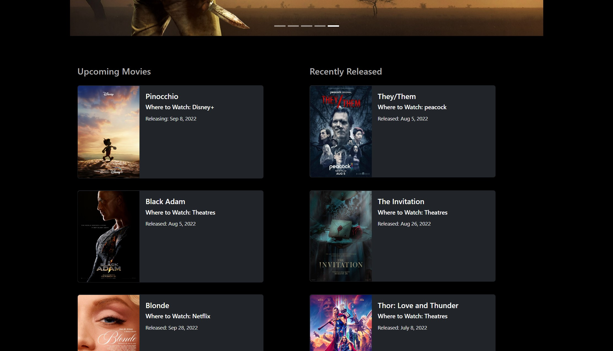
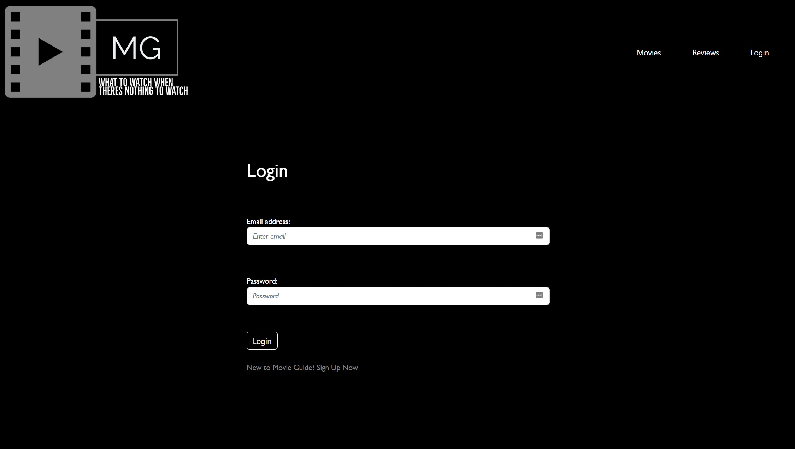
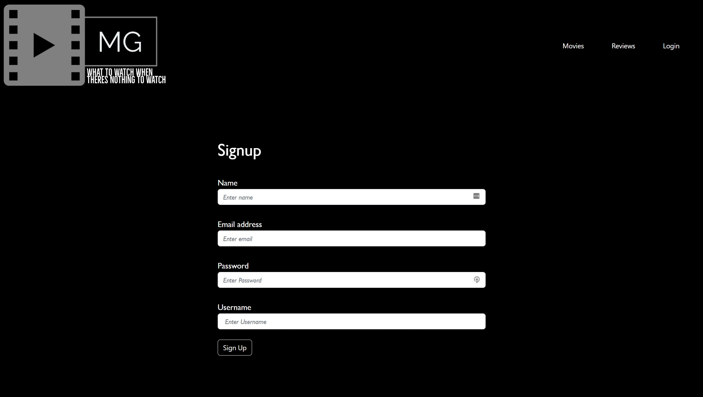
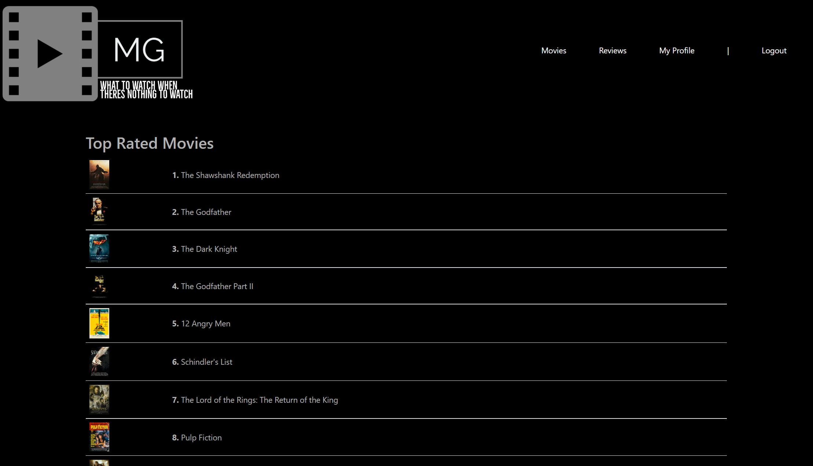
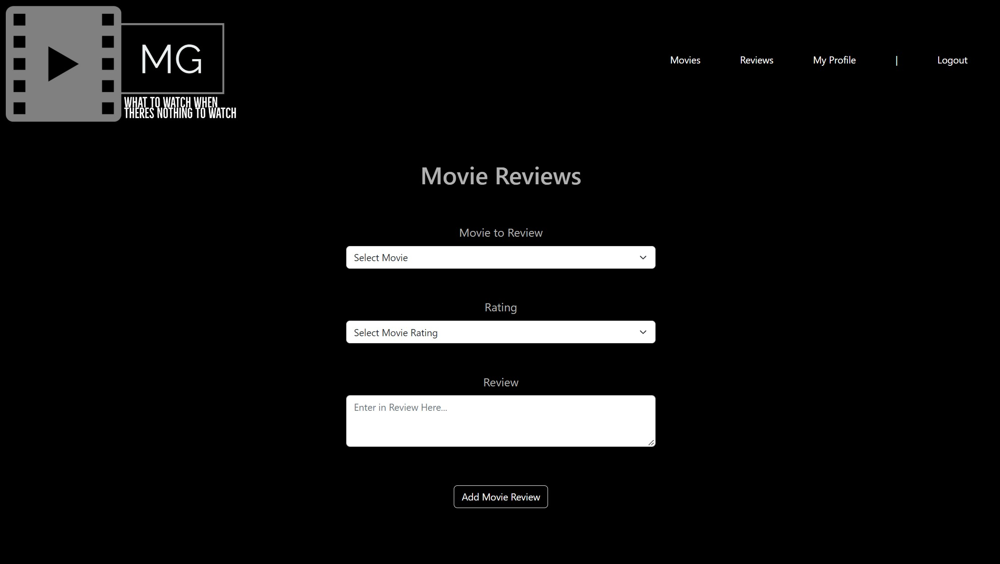
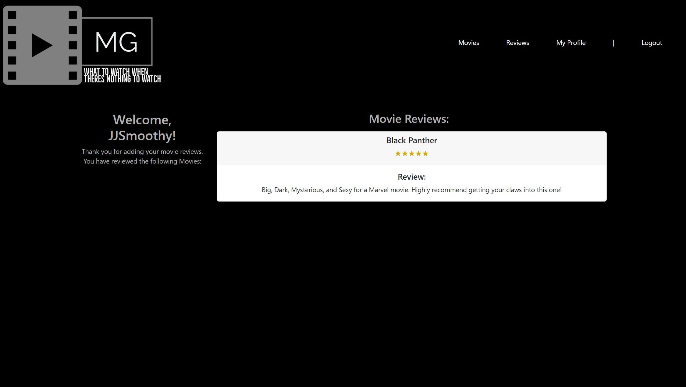

  <h1 align="center">Movie God<h1>

  

  ## TABLE OF CONTENTS
  - [Description](#description)
  - [Application-Link](#application-deployment-links)
  - [Installation](#Installation)
  - [Usage](#Usage)
  - [Media](#Media)
  - [License](#License)
  - [Contributors](#contributors)
  - [Questions](#Questions)

  ## DESCRIPTION
  The aim of this project was to create a Movie Guide.
  Phase One: Was a focus on allowing users to keep track of upcoming and movies that have recently released and with information on where to watch them.

  Phase Two: Was a focus on providing the functionality for the user to be able to rate and review movies. We also gave the user the ability to view which movies they have rated and reviewed.
  
  Phase Three: A future focus for the application will be on providing a watchlist feature where the User is able to add whatever movie they desire and set it to plan to watch or already watched. Planned movies may be set in three tiers of priority: Low, Medium and High. Within those tiers the user will be able to drag and rop the movies into an order of priority. Users will also be able to later on view other users profiles.
  
  ## Application Deployment Links:

  [Movie God](https://limitless-island-08145.herokuapp.com/)

  ## INSTALLATION
  To install the application to view the code:

  ##### From GitHub:

  1. Install NodeJS here: [Download NodeJS](https://nodejs.org/en/download/)

  ##### In your terminal:  
  2. To install the required NPM packages to run the backend functionality, Type `npm install` in the command line to install associated npm packages and node modules to be able to download all required packages under "dependencies in the "package.json" file.
  3. You will then need to create the database with the following commands in the terminal `mySQL -u root -p`, then type your password for your mySQL database.
  4. Secondly type `SOURCE DB/schema.sql` in the mySQL command terminal, then type `Quit` to quit the mySQL command console.
  5. Next you will need to prefill the database with seed data. Type `npm run seed` to seed DB.

  ## Usage

  * To run this node application, type `npm run start` to run the server. Then navigate to the webpage url.

  ## MEDIA
  #### Screenshot of Homepage (Top)
  

  #### Screenshot of Homepage (Bottom)
  

  #### Screenshot of Login Page
  

  #### Screenshot of Sign-up Page
  

  #### Screenshot of Top Rated Movies Page
  

  #### Screenshot of Movie Reviews Page
  

  #### Screenshot of My Profile Page
  
  
  ## LICENSE
  Project developed 2022 by Jason Steer, 
  This application is licensed under the Apache 2.0 license.
  
  ## Contributors
  Thank you to the people who helped contribute to this project.

  * Ghassan - For helping with the some routes and models and coding up the movies page and homepage upcoming and new release movies.
  * Ruby Hurst - For helping with the styling and theme of the project.
  * Aditya Gaikwad - For helping with a couple of annoying bug fixes.

  ## QUESTIONS
  For any questions on this project please contact me via my Github link or email. 

  **Find me on GitHub - UserName:** [eljsteer](https://github.com/eljsteer) 
  **Email me with any questions:** el.jsteer@gmail.com 
   
  
  _This README was generated with ❤️ by [LA-README-ZY](https://github.com/eljsteer/LA-README-ZY)_
